# MuraltZ Ground Control Station — System Diagrams

These diagrams use [Mermaid](https://mermaid.js.org/) syntax. They render in GitHub, GitLab, VS Code (with Mermaid extension), and many markdown viewers.

---

## 1. High-Level System Architecture

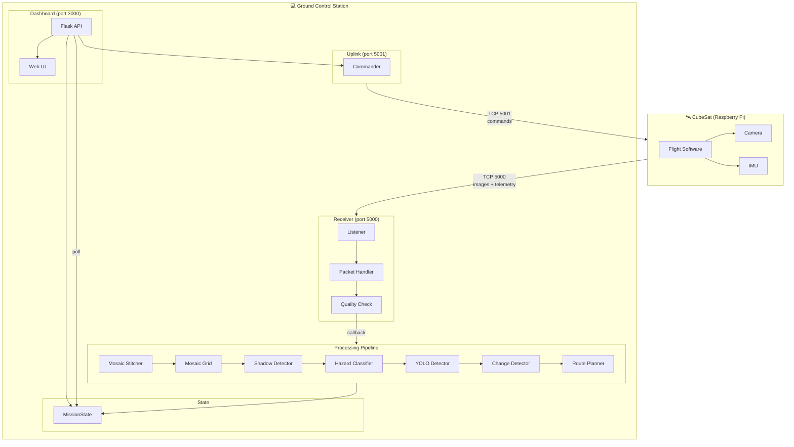

---

## 2. Image Reception Flow (Sequence)

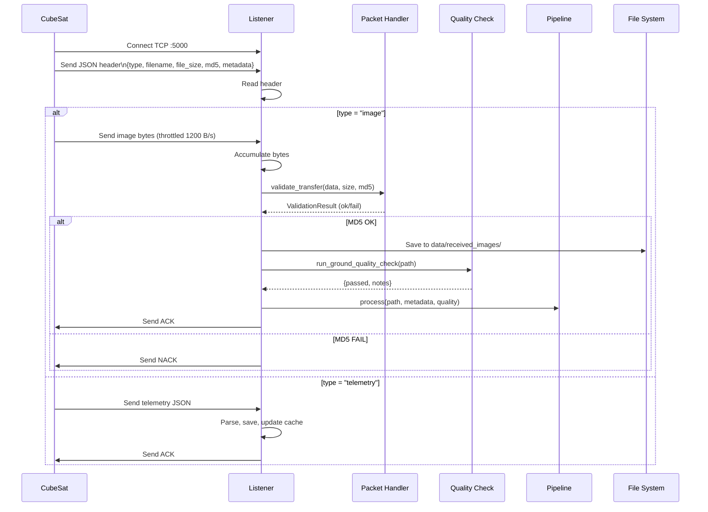

---

## 3. CV Pipeline Flow (Per Image)

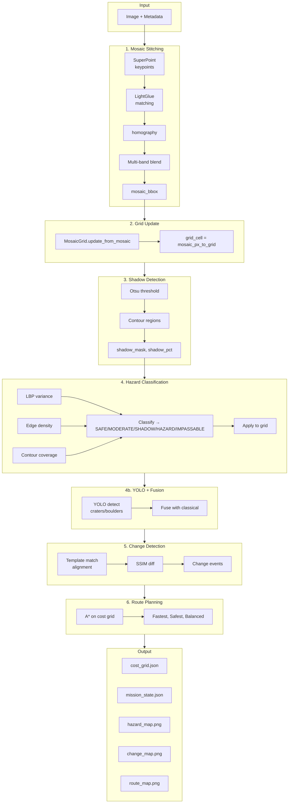

---

## 4. Pipeline Stage Dependencies

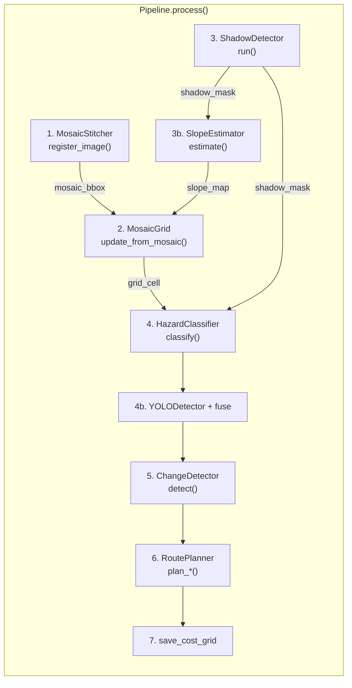

---

## 5. Dashboard Data Flow

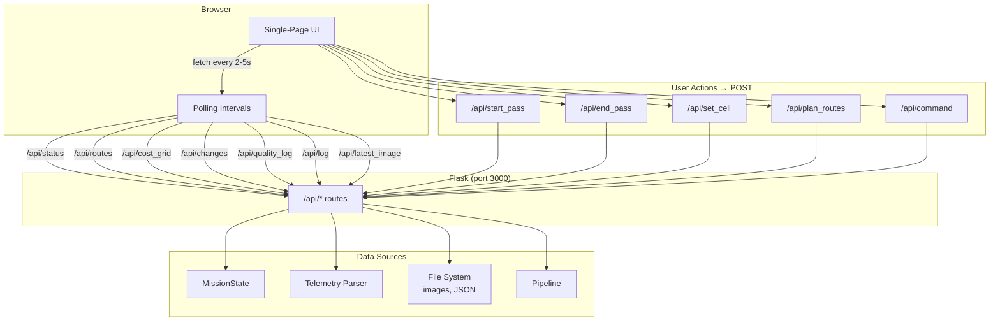

---

## 6. Transfer Protocol (CubeSat → GCS)

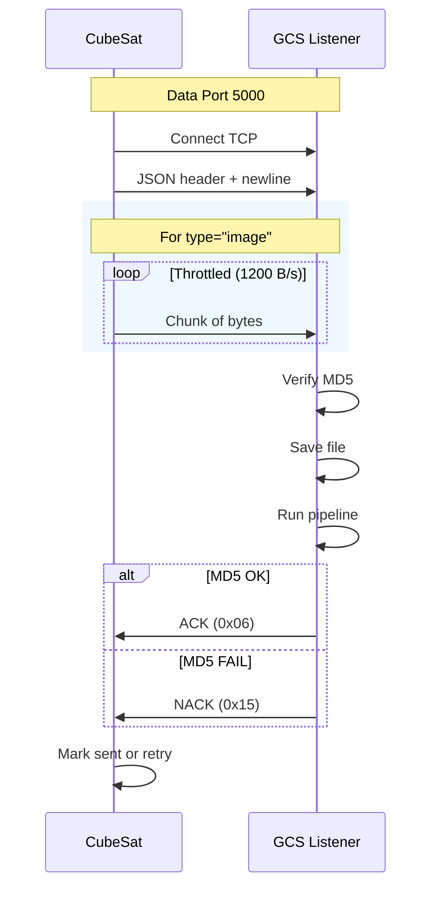

---

## 7. Command Protocol (GCS → CubeSat)

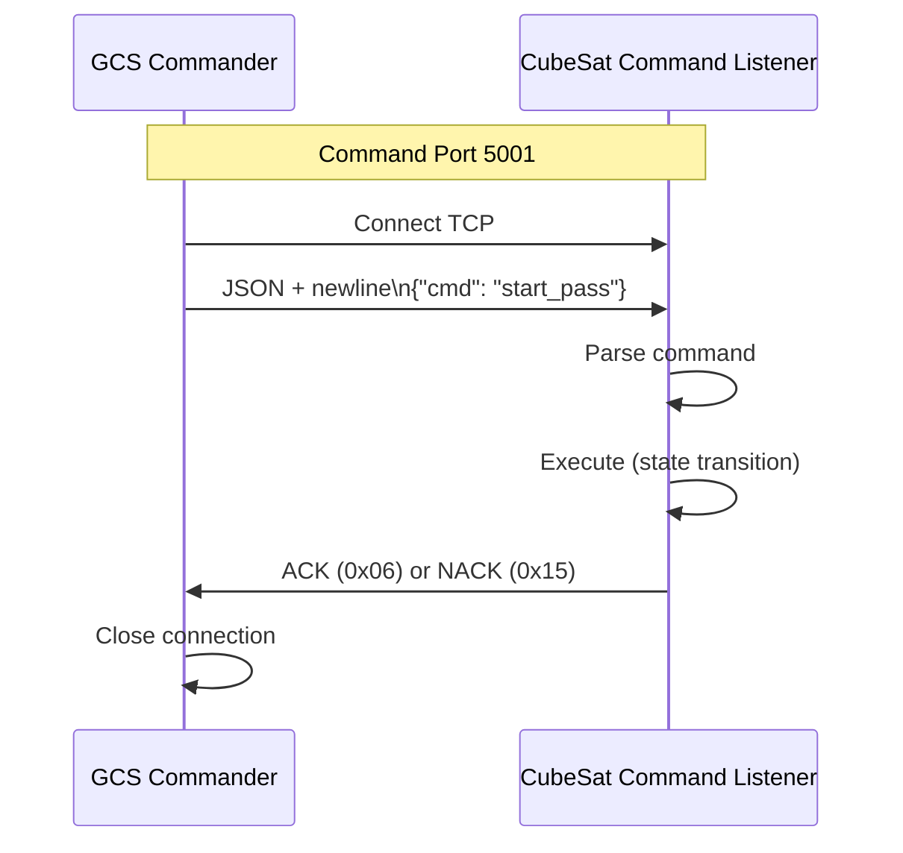

---

## 8. Mosaic → Grid → Route Flow

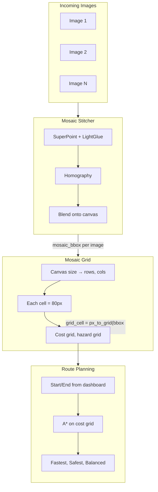

---

## 9. Component Relationships

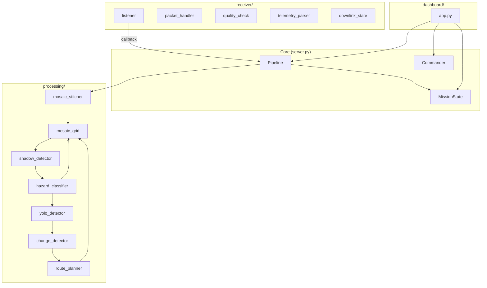

---

## 10. State Machine (CubeSat)

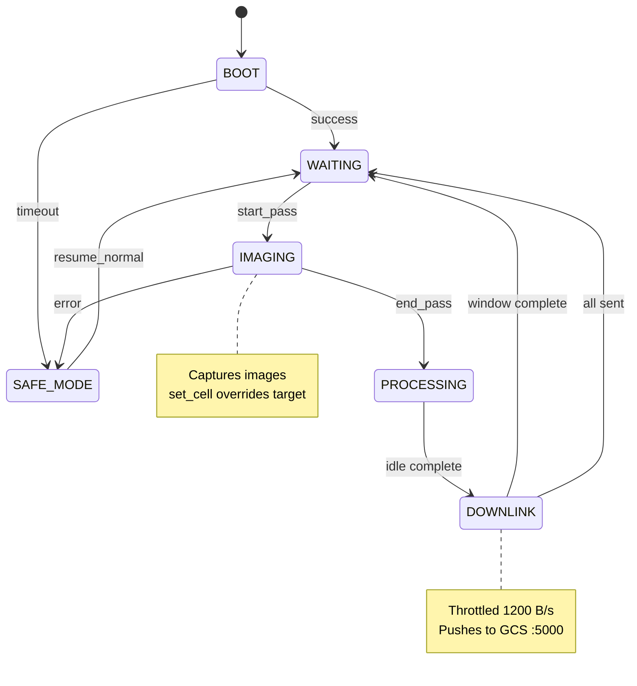

---

## 11. File Naming Convention

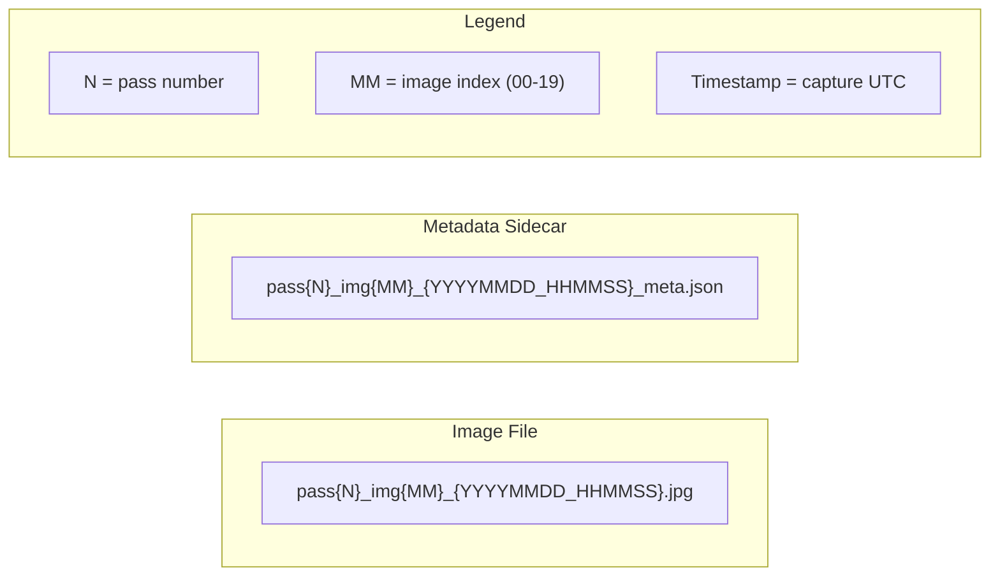

---

## 12. Data Storage Layout

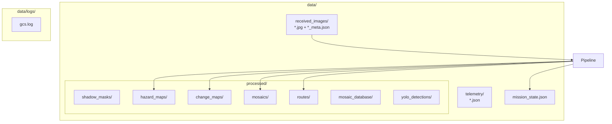

---

## Viewing These Diagrams

- **GitHub/GitLab:** Render automatically in markdown preview
- **VS Code:** Install "Markdown Preview Mermaid Support" extension
- **Online:** Paste into [mermaid.live](https://mermaid.live) to edit/export as PNG/SVG
- **CLI:** `npx @mermaid-js/mermaid-cli mmdc -i DIAGRAMS.md -o docs/` (requires mermaid-cli)
