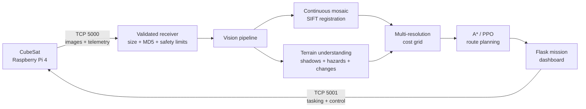
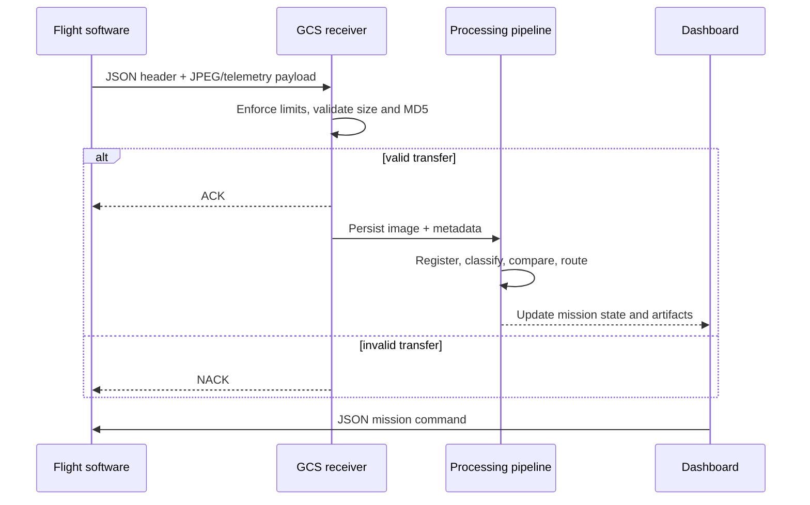

# MuraltZ CubeSat Ground Control Station

Ground software for an MIT Beaver Works Summer Institute CubeSat prototype that
turns constrained image downlinks into an operator-ready terrain map. The system
receives imagery and telemetry, verifies each transfer, builds a continuous
mosaic, identifies hazards and changes, and plans traversable routes.

> Companion repository: [MuraltZ flight software](https://github.com/Ayush1298567/MIT-BWSI-Cubesat)

## System at a glance



### Engineering highlights

- Bidirectional, ACK/NACK-based TCP protocol with MD5 integrity checks.
- Bounded receiver headers and payloads, plus filename traversal protection.
- Continuous image registration and multi-resolution terrain cost maps.
- Classical computer vision with optional YOLO, CNN, and PPO extensions.
- Multi-pass change detection and uncertainty-aware route planning.
- Persistent mission state, downlink accounting, and a real-time operator UI.
- Hardware-free simulation tools and regression tests for core algorithms.

## Data flow



## Quick start

Requires Python 3.10+.

```bash
git clone https://github.com/Ayush1298567/MIT-Cubesat-Ground-Control-Station.git
cd MIT-Cubesat-Ground-Control-Station
python3 -m venv .venv
source .venv/bin/activate
python -m pip install --upgrade pip
pip install -r requirements.txt
cp .env.example .env
```

Export any values you want to override, then start the station:

```bash
export CUBESAT_IP=192.168.1.229
cd ground_station
python server.py
```

Open [http://localhost:3000](http://localhost:3000). The receiver listens on
port `5000`; CubeSat commands use port `5001`.

### Run without hardware

Terminal 1:

```bash
cd ground_station
python server.py
```

Terminal 2:

```bash
python mock_cubesat.py --gcs-ip 127.0.0.1
```

For a dashboard-only portfolio demo, place this repository beside
`MIT-BWSI-Cubesat` and run:

```bash
cd ground_station
python tools/demo_full_fake.py --port 3002
```

## Processing architecture

| Stage | Responsibility | Representative implementation |
|---|---|---|
| Reception | Bounds checking, transfer integrity, persistence | `receiver/listener.py` |
| Registration | SIFT matching, homography estimation, mosaic blending | `processing/mosaic_stitcher.py` |
| Terrain analysis | Shadows, roughness, slope, hazards, semantic masks | `processing/` |
| Change detection | Align revisits and distinguish object/pixel changes | `processing/change_detector.py` |
| Planning | Cost-aware A*, route alternatives, optional PPO policy | `processing/route_planner.py` |
| Operations | Telemetry, tasking, route review, mission state | `dashboard/app.py` |

The full design and API reference live in
[`docs/ARCHITECTURE.md`](docs/ARCHITECTURE.md) and
[`PROJECT_DOCUMENTATION.md`](PROJECT_DOCUMENTATION.md). Assumptions and failure
modes are documented explicitly in
[`docs/ASSUMPTIONS_AND_LIMITATIONS.md`](docs/ASSUMPTIONS_AND_LIMITATIONS.md).

## Verification

```bash
cd ground_station
python -m unittest -v test_packet_handler.py test_change_detector.py
python test_mission_intelligence.py
python test_pipeline.py
python test_receiver.py
```

The tests cover transfer validation, path safety, synthetic end-to-end
reception, hazard extraction, multi-pass change detection, and route planning.
ML training dependencies are intentionally separate:

```bash
pip install -r requirements-ml.txt
```

## Repository map

```text
ground_station/
├── receiver/       # CubeSat → GCS transport and validation
├── processing/     # mapping, perception, change detection, planning
├── uplink/         # GCS → CubeSat commands and Pi management
├── dashboard/      # Flask operator interface and JSON API
├── llm/            # optional local mission Q&A integration
├── models/         # model download/training support
└── tools/          # simulation, calibration, evaluation, dataset tools
```

## Scope and limitations

This is prototype research software, not flight-certified software. Absolute
terrain localization is unavailable without an external reference; image
registration can drift on low-texture regolith; learned detectors depend on
training-domain quality; and route costs represent prototype rover assumptions.
These limitations are surfaced in the UI and documented rather than hidden.
